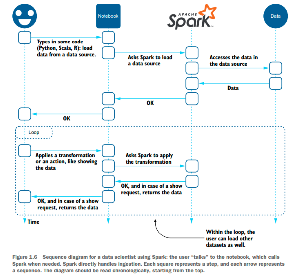
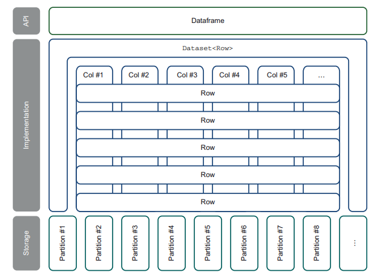

% Spark in Action: Second Edition
% Chapter 01
% So, what is Spark, anyway?

# So, what is Spark, anyway?

## Text Book


## 1.2.1 Spark in a data processing/data engineering scenario

- Data Engineers are data preparers
  - Spark is the perfect tool
  - 4 things generally done with Spark
    - Ingestion of Data
    - Improvement of data quality (DQ)
    - Transformation of data
    - Publication or accessibility of data

## Image of Data Engineering


## Spark in Data Science Scenario

- Scientists have slightly different approach then engineers
- Focus on the transformation part
  - [Jupyter](https://jupyter.org/ "Jupyter Notebooks")
  - [Zeppelin](https://zeppelin.apache.org/ "Apache Zeppelin")
  - [IBM Watson Studio](https://cloud.ibm.com/catalog/services/watson-studio "IBM Watson Studio")
  - [DataBricks Runtime](https://databricks.com/product/databricks-runtime "DataBricks Runtime")
  - [Pandas?](https://pandas.pydata.org/ "Python Pandas")

## Image of Data Science



## Uses of Spark

- 1.3.1 Predicting Restaurant Quality for State Governments
- 1.3.2 Lumeris health data company fast transformation
  - Converting CSV files to HL7 FHIR resources
- 1.3.3 Analyzing equipment logs at CERN for LHC
  - 1 Petabyte of data per second!

## 1.4 The DataFrame From Java Perspective

- The DataFrame is how Spark happens
  - This is the data type Spark uses (\*essentially)
- Similarities to a JDBC `ResultSet`
  - Data is accessible from a simple API
  - You can access the schema
- Differences
  - Do not browse via a `next()` method
  - No foreign or primary keys
  - Implemented as a `DataSet<Row>` data type

## 1.4.2 DataFrames from a RDBMS Perspective

- Similarities to a RDBMS Table
  - Data is described in Rows and Columns
  - Columns are strongly typed
- Differences
  - Data can be nested (JSON and XML docs)
  - You don’t update or delete entire rows (data is immutable)
  - You create a new DataFrame (immutable)
  - No constraints, indices, keys, or triggers
- The DataFrame is what we will use throughout the time using Spark

## Image of DataFrame



## First Sample Code

- In your Ubuntu virtual machine:
- Clone the sample code repo for chapter 01 at:
  - [https://github.com/jgperrin/net.jgp.books.spark.ch01](https://github.com/jgperrin/net.jgp.books.spark.ch01 "GitHub repo for Chapter 01")
- Install `Maven` via `apt`
  - `sudo apt-get install maven`
  - mvn -version

## 1.5.3 Running a Sample

- Run this sample code from the command line:
  - `mvn clean install exec:exec`

## 1.5.4 Code in Java

```Java
package net.jgp.books.spark.ch01.lab100_csv_to_dataframe;
import org.apache.spark.sql.Dataset;
import org.apache.spark.sql.Row;
import org.apache.spark.sql.SparkSession;

public class CsvToDataframeApp {
 public static void main(String[] args) {
 CsvToDataframeApp app = new CsvToDataframeApp();
 app.start();
 }
 private void start() {
 SparkSession spark = SparkSession.builder()
 .appName("CSV to Dataset").master("local").getOrCreate();
 Dataset<Row> df = spark.read().format("csv")
 .option("header", "true").load("data/books.csv");
 df.show(5);
 }
}
```

## 1.5.4 Description of Java Code

- Entry point
  - `main()` (like a normal Java Program)
- `SparkSession()`
  - Creates a local session (for now) of a Spark Class
- Ingest data from a CSV
  - Reads data from a CSV and stores a copy of the data in a DataFrame
- Show
  - `df.show(5)` is a transformation which displays first 5 records (LIMIT 5)

## What does this accomplish?

- Shows we Install all needed components for Spark
- Created a SparkSession where code code be executed
- Loaded a CSV file
- Displayed 5 rows of output

## Example Code in Python

```python
from pyspark.sql import SparkSession
import os
current_dir = os.path.dirname(__file__)
relative_path = "../../../../data/books.csv"
absolute_file_path = \
os.path.join(current_dir, relative_path)
# Creates a session on a local master
session = SparkSession.builder
.appName("CSV to Dataset")
.master("local[*]").getOrCreate()
# Reads a CSV file with header, 
#called books.csv, stores it in a dataframe
df = session.read.csv
(header=True, inferSchema=True, path=absolute_file_path)
# Shows at most 5 rows from the dataframe
df.show(5)
```

## How to Run Spark Python Code

- From the command line in your VM:
  - `cd net.jgp.books.spark.ch01/src/main/python/lab100_csv_to_dataframe`
  - Run the command: `spark-submit ./csvToDataframeApp.py`
  - You will see the same output as the Java Spark Code

## Summary

- Spark is an analytics operating system
  - You can use it to process workloads and algorithms in a distributed way
  - You can use Spark for data transfer, massive data transformation, log analysis, and more
- Spark supports SQL, Java, Scala, R, and Python
- Spark’s internal main data storage is the dataframe
  - The dataframe combines storage capacity with an API
  - In Java, a dataframe is implemented as a `Dataset<Row>`

## Next Steps

- I will provide a recorded lecture with Chapter-02 content
- With small lab by Thursday evening
